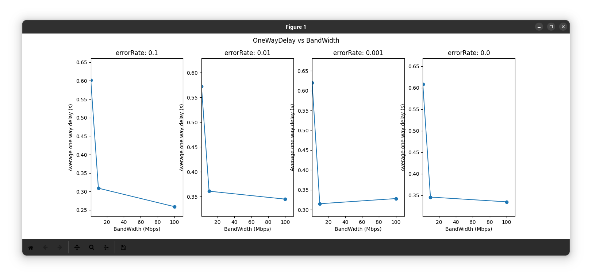
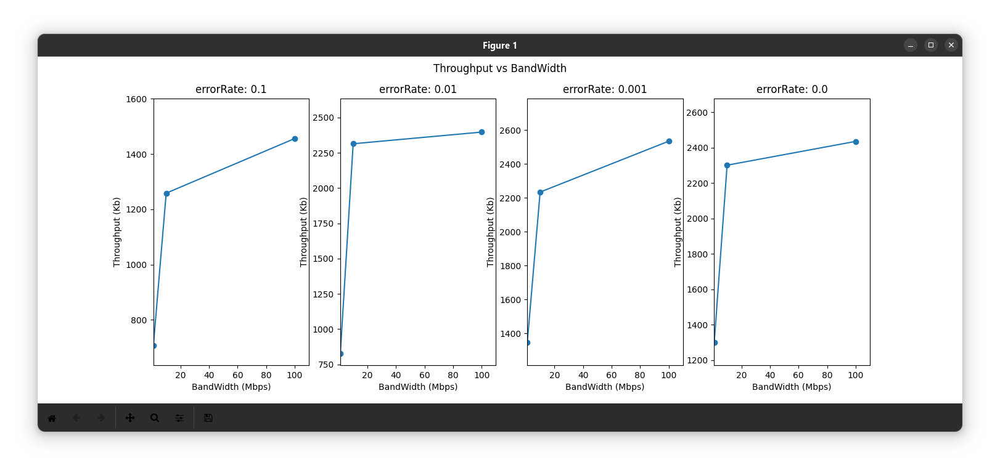
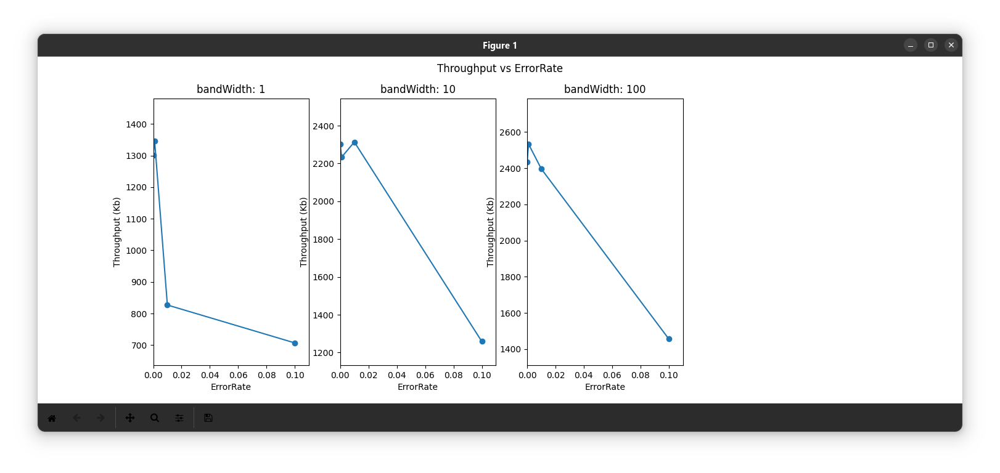

# CN-CA2-Hesam-Melika-Borna

## About:

Our second *Computer Networks* computer assignment.

* NS3 Simulation

### People:

This project was a mutual work of the following people:

    @github/HesamAsad
    @github/Melikad
    @github/Borna-tl

## Project Description:
### IEEE 802.11

IEEE 802.11 is part of the IEEE 802 set of local area network (LAN) technical standards, and specifies the set of media access control (MAC) and physical layer (PHY) protocols for implementing wireless local area network (WLAN) computer communication. The standard and amendments provide the basis for wireless network products using the Wi-Fi brand and are the world's most widely used wireless computer networking standards. IEEE 802.11 is used in most home and office networks to allow laptops, printers, smartphones, and other devices to communicate with each other and access the Internet without connecting wires.

### NS-3

ns-3 is a discrete-event network simulator for Internet systems, targeted primarily for research and educational use. ns-3 is free, open-source software, licensed under the GNU GPLv2 license, and maintained by a worldwide community.

### Problem
We're about to implement the following schema:

```
                      [IEEE 802.11 links]
[Sender0] --|                                     |--[Receiver0]
[Sender1] --|                                     |--[Receiver1]
[Sender2] --|--(UDP)--> [Load Balancer] --(TCP)-->|--[Receiver2]
[Sender3] --|                                     |--[Receiver3]
[Sender4] --|                                     |--[Receiver4]
```

Senders use `UDP` in order to send their packets to the load balancer. The load balancer use `TCP` in order to send received packets to the receivers.
It's obvious that the load balancer should send each packet to just one of the receivers. `random` load balancing algorithm is used in this simulation (load balancer randomly chooses one of the receivers and send the received packet to that).

### Load Balancing
The randomized load-balancing algorithm randomly distributes requests to servers using a random number generator. When a load balancer receives a request, the randomized algorithm evenly distributes it to the servers. Like the round robin algorithm, this algorithm works well for a group of servers with similar configurations.

### Code Details
1. Create left, right, and load balancer nodes
```cpp
  NodeContainer router_node; 
  router_node.Create (1);
  NodeContainer left_nodes; 
  left_nodes.Create (5);
  NodeContainer right_nodes; 
  right_nodes.Create (5);
```

2. Place nodes somehow, this is required by every wireless simulation
```cpp
  MobilityHelper mobility;
  mobility.SetPositionAllocator ("ns3::GridPositionAllocator",
                                  "MinX", DoubleValue (0.0),
                                  "MinY", DoubleValue (0.0),
                                  "DeltaX", DoubleValue (5.0),
                                  "DeltaY", DoubleValue (10.0),
                                  "GridWidth", UintegerValue (3),
                                  "LayoutType", StringValue ("RowFirst"));
                                  mobility.SetMobilityModel ("ns3::ConstantPositionMobilityModel");
  mobility.Install (left_nodes);
  mobility.Install (router_node);
  mobility.Install (right_nodes);
```

3. Create propagation loss matrix
```cpp
  Ptr<MatrixPropagationLossModel> lossModel = CreateObject<MatrixPropagationLossModel> ();
  lossModel->SetDefaultLoss (60); // set default loss to 60 dB (no link)
  lossModel->SetLoss (left_nodes.Get (0)->GetObject<MobilityModel> (), router_node.Get (0)->GetObject<MobilityModel> (), 50); // set symmetric loss l0 <-> r to 50 dB
  lossModel->SetLoss (left_nodes.Get (1)->GetObject<MobilityModel> (), router_node.Get (0)->GetObject<MobilityModel> (), 50); // set symmetric loss l1 <-> r to 50 dB
  lossModel->SetLoss (left_nodes.Get (2)->GetObject<MobilityModel> (), router_node.Get (0)->GetObject<MobilityModel> (), 50); // set symmetric loss l2 <-> r to 50 dB
  lossModel->SetLoss (left_nodes.Get (3)->GetObject<MobilityModel> (), router_node.Get (0)->GetObject<MobilityModel> (), 50); // set symmetric loss l3 <-> r to 50 dB
  lossModel->SetLoss (left_nodes.Get (4)->GetObject<MobilityModel> (), router_node.Get (0)->GetObject<MobilityModel> (), 50); // set symmetric loss 14 <-> r to 50 dB
  lossModel->SetLoss (right_nodes.Get (0)->GetObject<MobilityModel> (), router_node.Get (0)->GetObject<MobilityModel> (), 50); // set symmetric loss r <-> r0 to 50 dB
  lossModel->SetLoss (right_nodes.Get (1)->GetObject<MobilityModel> (), router_node.Get (0)->GetObject<MobilityModel> (), 50); // set symmetric loss r <-> r1 to 50 dB
  lossModel->SetLoss (right_nodes.Get (2)->GetObject<MobilityModel> (), router_node.Get (0)->GetObject<MobilityModel> (), 50); // set symmetric loss r <-> r2 to 50 dB
  lossModel->SetLoss (right_nodes.Get (3)->GetObject<MobilityModel> (), router_node.Get (0)->GetObject<MobilityModel> (), 50); // set symmetric loss r <-> r3 to 50 dB
  lossModel->SetLoss (right_nodes.Get (4)->GetObject<MobilityModel> (), router_node.Get (0)->GetObject<MobilityModel> (), 50); // set symmetric loss r <-> r4 to 50 dB
```

4. Create & setup wifi channel
```cpp
  Ptr<YansWifiChannel> wifiChannel = CreateObject <YansWifiChannel> ();
  wifiChannel->SetPropagationLossModel (lossModel);
  wifiChannel->SetPropagationDelayModel (CreateObject <ConstantSpeedPropagationDelayModel> ());
```

5. Install wireless devices
```cpp
  WifiHelper wifi;
  wifi.SetStandard (WIFI_STANDARD_80211ac);
  wifi.SetRemoteStationManager ("ns3::ConstantRateWifiManager",
                                "DataMode", StringValue ("OfdmRate54Mbps"),
                                "ControlMode", StringValue ("OfdmRate54Mbps"));
  YansWifiPhyHelper wifiPhy;
  wifiPhy.SetChannel (wifiChannel);
  wifiPhy.SetErrorRateModel ("ns3::NistErrorRateModel");
  WifiMacHelper staWifiMac, apWifiMac;
  staWifiMac.SetType ("ns3::StaWifiMac");
  apWifiMac.SetType ("ns3::ApWifiMac");
  NetDeviceContainer left_devices = wifi.Install (wifiPhy, staWifiMac, left_nodes);
  NetDeviceContainer router_device = wifi.Install (wifiPhy, apWifiMac, router_node);
  NetDeviceContainer right_devices = wifi.Install (wifiPhy, staWifiMac, right_nodes);
```

6. Install TCP/IP stack & assign IP addresses
```cpp
  InternetStackHelper internet;
  internet.Install (left_nodes);
  internet.Install (router_node);
  internet.Install (right_nodes);
  
  Ipv4AddressHelper ipv4_le, ipv4_ro, ipv4_ri;  
  ipv4_le.SetBase ("10.0.1.0", "255.255.255.0");
  ipv4_ro.SetBase ("10.0.0.0", "255.255.255.0");
  ipv4_ri.SetBase ("10.0.2.0", "255.255.255.0");
  Ipv4InterfaceContainer left_addresses = ipv4_le.Assign (left_devices);
  Ipv4InterfaceContainer router_address = ipv4_ro.Assign (router_device);
  Ipv4InterfaceContainer right_addresses = ipv4_ri.Assign (right_devices);
```

7. Install Applications:
```cpp
OnOffHelper onOffHelper ("ns3::TcpSocketFactory", InetSocketAddress (right_addresses.GetAddress ((rand()%5)), cbrPort));
```

8. Results:
    1. OneWayDelay vs BandWidth:

    2. Throughput vs BandWidth:

    3. Throughput vs ErrorRate:


9. Analysis:
* Throughput is calculated as: received_size/simulation_time
* AvgEnd2EndDelay is calculated as: sum(receive_times)/packets_received
* As bandwidth increases, average end-to-end delay is decreased as shown in the first figure. 
* Throughput increases as bandwidth increases. This is theoretically obvious and is shown via simulation results in the second figure.
* Throughput decreases as error rate increases. this is because of the increase packet loss and decay in received_size. 

Thanks!